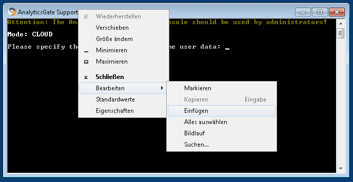

# Manual installation of AnalayticsGate Cloud Reporting

1. Transfer the portable zip file to the desktop.
2. Extract the zip file.
3. Rename the unzip folder to "AGCloudReporting".
4. Copy the unzip folder to "C:\Program Files" or "C:\Programme".
5. Create a user data folder "AGCloudShare" under C:\ for your apps and templates.
6. Start the Support Console in Folder "C:\Program Files\AGCloudReporting\SupportConsole\AgSupportConsole.exe" and follow the instructions in the console to create a config file.
7. Select 4 to install all services manually. Go through the submenu from 1 to 4.
8. Select 11 to install cloud environment.
9. Select 9 to install the firewall rules.
10. Select 6 to start all services manually. Go through the submenu from 1 to 4.
11. Select 13 to create the desktop link.

# Important notes

On Windoes Server 2012 and Windoes Server 2012 R2 the installation of the Microsoft Visual C++ Redistributable package is required.
[https://aka.ms/vs/17/release/vc_redist.x64.exe](https://aka.ms/vs/17/release/vc_redist.x64.exe)

The .NET Runtime and the ASP.NET Core Runtime in version 6 (.NET6) as 64Bit (x64) are required.  
[https://dotnet.microsoft.com/en-us/download/dotnet/6.0](https://dotnet.microsoft.com/en-us/download/dotnet/6.0)

First install the .NET Runtime, then install the ASP.NET Core Runtime.

The default link to open the meagment console is [https://localhost:40267](https://localhost:40267)

Inserting text into an old Windows console

